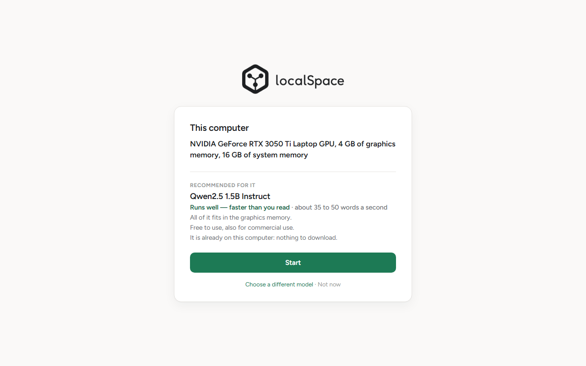
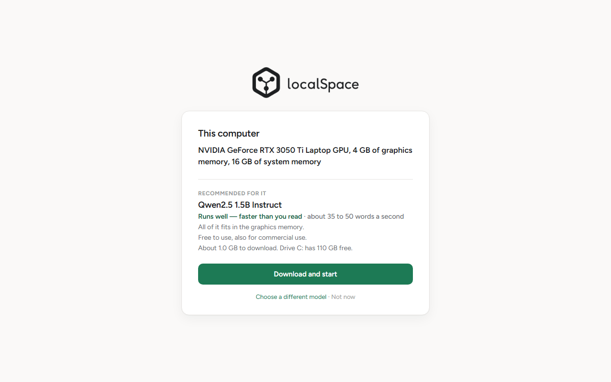

# localSpace — tester sheet (Friday 25 September)

One page. Part 1 is five questions to answer **before** the day; part 2 is
the day itself. Nothing here needs a terminal or any technical knowledge.

> **For us, not for testers — delete this block before sending.** Part 1
> is the screening the user took on to send on the 18th. Part 2 matches the build as of 19 September: the
> first run says what the computer is, recommends a model with how it will
> run, and its download continues after an interruption. The two pictures of
> the first run under step 5 are from the build of 19 September on our own
> laptop (the page is the same everywhere but for what it says about the
> computer and which model it names; they are taken again if the rule behind
> the recommendation changes). Screenshots of the two Windows messages are
> added after the dry run of Thursday 24th, from the real build on a real
> machine that is not ours. The
> models a laptop is offered today are 0.5 GB, 1.0 GB, 2.0 GB, 4.4 GB and
> 8.4 GB to download, so "about 10 GB" of free disk covers every one of them.
>
> **On the day the models do not come over the venue's wifi.** Ten people
> downloading at once share one pipe. Copy the models from a USB stick or a
> share into each laptop's `%LOCALAPPDATA%\localSpace\models` (make the folder
> if the app has not run yet), before or after installing. The app checks
> each file against its published SHA-256 and then says "It is already on
> this computer: nothing to download", with a **Start** button. A file that
> is not the published one does not count; a model that is not on the stick
> is downloaded as before. The files and their digests are in
> `models/catalog.json`; `node scripts/check-catalog.mjs` checks them against
> Hugging Face.
>
> **What the models answer** to nineteen ordinary messages, model by model,
> is in `docs/test-a/MESSAGE-SCRIPT.md`. In short: the 7B and the 14B are
> reliably good; the 1.5B is fast and gets a sum, a date or a capital wrong
> often enough that a tester will meet it; asked for the weather, the larger
> ones try a web search that is not set up and say they found nothing.

## Part 1 — before the day: five things to send us

Open **Task Manager** (press Ctrl+Shift+Esc) and choose **Performance**.

1. **Graphics card.** Click *GPU* (if there are two, the one that is not
   "Intel UHD" or "AMD Radeon Graphics"). Send the name at the top right and
   the number beside *Dedicated GPU memory*, for example
   "NVIDIA GeForce RTX 4060 Laptop GPU, 8.0 GB". No GPU entry at all is a
   fine answer too: say so.
2. **Memory.** Click *Memory* and send the number at the top right, for
   example "16.0 GB".
3. **Free disk space.** Open File Explorer, choose *This PC*, and send the
   free space of drive C:. localSpace and one model need about 10 GB.
4. **Windows.** Press the Windows key, type *About your PC*, press Enter,
   and send the *Edition* and *Version* lines (for example
   "Windows 11 Home, 24H2").
5. **Smart App Control.** Press the Windows key, type *Smart App Control*,
   press Enter. Send the word that is selected: **On**, **Evaluation** or
   **Off**. **Please do not change it.** It cannot be turned back on without
   reinstalling Windows, and we only need to know.

## Part 2 — on the day

1. **Get the file** we send you: `localSpace-…-setup.exe`.
2. **Run it.** Double-click it. It asks for nothing: *Next*, *Install*,
   *Finish*. It installs for you only and does not ask for an administrator.
3. **If Windows stops it,** it shows one of two messages, because this test
   build is not signed yet:
   - **"Windows protected your PC"** (a blue window): click **More info**,
     then **Run anyway**.
   - **"Smart App Control blocked an app that may be unsafe"**: there is no
     button that lets it through, and nothing to fix on your side. Do not
     change any Windows setting. Tell the person running the test: you will
     take part on another machine or watch a neighbour's.
4. **Start localSpace** from the Start menu if it did not open by itself.
   The first start takes a moment.
5. **Read what it says about your computer**, and the model it recommends
   with how fast it expects it to be. Then choose the green button. It says
   **Start** when the model is already on your computer (we copied it there),
   and **Download and start** when it is not: that download is between one
   and eight gigabytes, carries on by itself if the connection drops, and,
   if you close the app, goes on from where it stopped when you open it
   again and choose **Continue the download**.

   

   

6. **Chat.** Ask it anything. Then try something long, such as "explain how
   a heat pump works, in detail". It answers from what it has learned: it
   cannot look up today's weather or the news, and it can be wrong, the
   smaller models more often. Nothing you type leaves your computer unless
   it asks to fetch a web page and you allow it.

### What to write down

- What the app said about your computer (one line), and the model it
  recommended.
- The speed it promised ("about 20 to 30 words a second", for instance),
  and whether the answers felt like that, faster, or slower.
- How long the first word of an answer took: under two seconds, a few
  seconds, or longer.
- Anything that stopped you, word for word if there was a message.

If someone asks you for "the log": paste
`%LOCALAPPDATA%\localSpace\logs` into the address bar of File
Explorer and send the file `app.log`.

### Afterwards

Keep it or remove it: Windows Settings → Apps → localSpace → Uninstall. Tick
*Delete the application data* to remove the downloaded model too.
